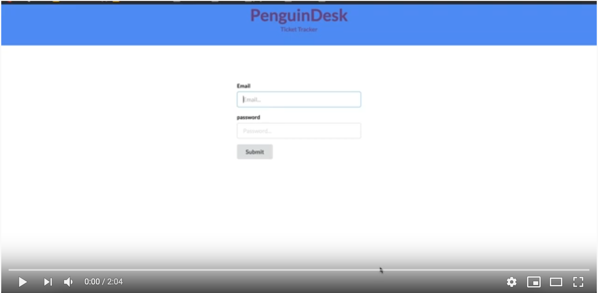

## PenguinDesk
PenguinDesk is a ticket tracking system created as my final project for term 2 of the web development immersive program at [Code Immersives](https://www.codeimmersives.com/#). It has a React frontend, a Node backend and uses MongoDB for data storage.
  
## Routes/Usage
### Login
* Login and create a session in order to start using the app.
### New Ticket
* Create a new ticket.
### Open Tickets
* View all open tickets.
### Closed Tickets
* View all closed tickets.
### Search Tickets
* Search the displayed tickets (open or closed) based on the issue field.
### Logout
* Logout the current user and end the session.
## Installation
* Create a container directory to hold the front and back ends of the app.
* Fork the frontend here and the backend [here](https://github.com/phenix1229/penguinDesk-backend).
* Clone each part into the container directory you created.
* CD into each cloned directory and run NPM install.
* In the frontend directory, add a proxy to the package.json file.

*Example:*

    "proxy": "http://localhost:8080"
    //substitute 8080 for your port number

* In the backend directory, create a .env file.
* In the .env file, add a port number (if you like), a path for your MongoDB database, and a secret string for your session.

*Example:*

    PORT = (port number)
    MONGODB_URI = (db path)
    SESSION_SECRET = (secret string)

* Once done, open two separate terminal windows.
* In one terminal, navigate to the backend directory and run npm start.
* In the other terminal, navigate to the frontend directory and run npm start.

*Demo:*

Thank you for stopping by.